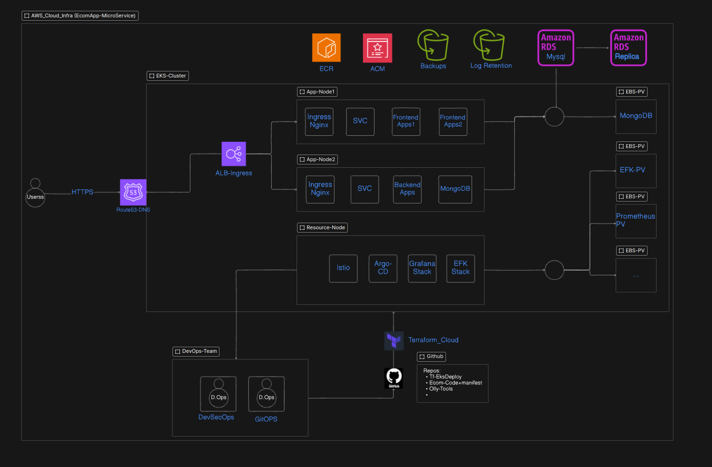
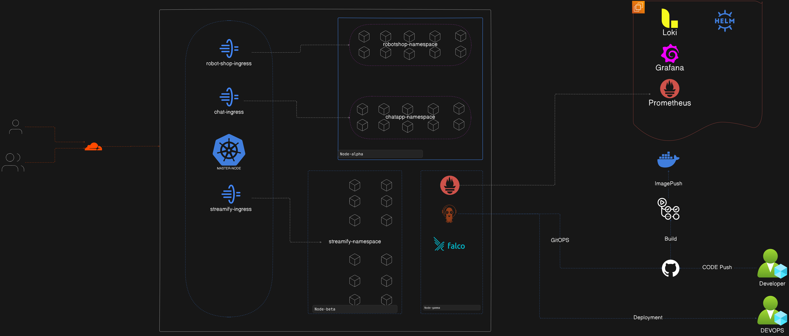

# EKS_AKS_EcomApp_DR-OPS

Welcome to the **Ecom Robot Shop** deployment project! This is a **production-grade, enterprise-level microservices-based e-commerce application** inspired by IBM's **Instana Robot Shop**, deployed using **DevSecOps** best practices for scalable, secure, and reliable production environments. This repository encapsulates the entire lifecycle of the application, from development to deployment, across multiple cloud environments like **AWS EKS**, **Azure AKS**, and **DigitalOcean Kubernetes**.

This application showcases a microservices architecture designed for testing and learning purposes, with each service built in a different technology stack.

## 🚀 **Overview**

The **Ecom Robot Shop** is a fully functional e-commerce application implemented as microservices. The app includes services for managing products, orders, customers, payments, and more. It is designed to simulate a real-world e-commerce platform with integrated services, including a **frontend** built using **AngularJS** and a **backend** with technologies like **NodeJS**, **Java**, **Python**, **Go**, **PHP**, **Redis**, **RabbitMQ**, and **MongoDB**.

## 📊 **Infrastructure Diagrams**

### AWS Infrastructure


### Azure Infrastructure `Coming Soon`
<!--  -->


### KubeAdm-Setup Infra



## 🛠 **Tech Stack**

### **Frontend:**
- **Framework:** AngularJS (1.x)
- **Styling:** Custom CSS

### **Backend:**
- **Node.js** (with Express.js)
- **Java** (with Spring Boot)
- **Python** (with Flask)
- **Golang**
- **PHP** (Apache)
- **MongoDB** (with Persistent Volumes and Claims)
- **Redis**
- **MySQL** (with Maxmind data integration)
- **RabbitMQ**
- **Nginx**

### **Infrastructure & Tools:**
- **Kubernetes (K8s):** AWS EKS, Azure AKS, DigitalOcean Kubernetes
- **CI/CD:** GitHub Actions, Jenkins, GitOps with Argo CD
- **Docker:** Containerization of frontend and backend services
- **Terraform Cloud:** Infrastructure as Code (IaC) for automated provisioning
- **Ingress Controllers:** AWS ALB, Azure Application Gateway, NGINX, Kubernetes API Gateway
- **Monitoring & Logging:** Grafana, Prometheus, Loki, EFK stack (ElasticSearch, Fluentd, Kibana)
- **Certificates:** Let’s Encrypt, AWS ACM
- **Security:** Web Application Firewall (WAF), ConfigMaps, Secrets management
- **Storage:** AWS S3 Buckets, Persistent Volumes (PV) with EBS and Azure Disk
- **Networking:** Route 53, Cloudflare
- **Registry:** DockerHub, Elastic Container Registry (ECR)

## 📂 **Project Structure**

```
.
├── ecomapp-code-dir               # application
├── kubernetes-manifests           # Kubernetes manifests for AKS, EKS
├── Helm-Charts                    # Kubernetes HelmCharts for AKS, EKS
└── README.md                     # You are here!
```


## 💡 **What You Get in This Project**

### **Features:**
- **Multi-Cloud Deployment:**  
  Easily deploy on **AWS EKS**, **Azure AKS**, or **DigitalOcean Kubernetes**, optimized for platform-specific capabilities like **AWS ALB Ingress** and **Azure Application Gateway**.

- **Scalable Architecture:**  
  Supports **Horizontal Pod Autoscaling (HPA)** for efficient resource management and integrates load balancers for seamless traffic distribution.

- **Security Best Practices:**  
  Implements **ConfigMaps** and **Secrets** for secure data handling, **WAF** for enhanced security, and **TLS/SSL Certificates** using **Let’s Encrypt** and **AWS ACM**.

- **Real-Time Monitoring:**  
  Integrated with **Grafana Dashboards** for visualizations, **Prometheus Metrics** for real-time monitoring, and **Loki** for centralized log management.

- **Centralized Logging:**  
  Uses the **EFK Stack (ElasticSearch, Fluentd, Kibana)** for centralized log aggregation and visualization, with long-term storage supported by **AWS S3** or **Azure Blob Storage**.

- **Persistent Data Storage:**  
  Ensures database persistence with **MongoDB** on **Persistent Volumes** backed by **AWS EBS** and **Azure Disk** for fault tolerance and data retention.

- **Automated Deployments:**  
  Simplifies deployment using **Helm Charts** and **Argo CD** for GitOps-based automation.

- **CI/CD Pipelines:**  
  Streamlines the build, test, and deployment processes with **GitHub Actions**, **Jenkins**, and **Argo CD**, ensuring reliable and consistent delivery.

- **Networking and DNS Management:**  
  Utilizes **Route 53** and **Cloudflare** for DNS management and supports ingress options such as **NGINX Ingress**, **AWS ALB**, and **Azure Application Gateway**.

- **Disaster Recovery:**  
  Implements **secure backups** for critical resources like **MongoDB** and application logs, using **AWS S3** or **Azure Storage** for high availability.

- **DevSecOps Integration:**  
  Features **SonarQube** for continuous code quality analysis and **Trivy Scans** for container image vulnerability assessments.

- **Observability:**  
  Configures **Prometheus Alertmanager** and **Grafana Alerts** for proactive notifications and integrates **distributed tracing** for detailed flow analysis.

- **Istio Service Mesh:**  
  Manages traffic, enhances service-to-service communication, and applies policies within Kubernetes clusters.

- **Kubernetes Dashboard & K9s:**  
  Provides a web-based UI for Kubernetes management and **K9s** for terminal-based interaction with the Kubernetes clusters.

- **Cert-Manager:**  
  Automates the issuance and renewal of TLS/SSL certificates for Kubernetes resources.

- **Helm-Chats:**
  The Helm chart for installing 

## 🚀 **Getting Started**

### 1. **Prerequisites**
- **Docker** installed on your local machine
- A **Kubernetes cluster** (EKS, AKS, or DigitalOcean) set up
- **Terraform** for provisioning infrastructure
- **GitHub Actions** configured for CI/CD

### 2. **Clone the Repository**
```bash
git clone https://github.com/ahmadrazalab/EcomRobotShop.git
cd EcomRobotShop
```

### 3. **Build Docker Images**
Navigate to the respective directories and build the Docker images for both frontend and backend:
```bash
# Build backend Docker image
cd ecomapp-backend
docker build -t ecomapp-backend .

# Build frontend Docker image
cd ecomapp-frontend
docker build -t ecomapp-frontend .
```

### 4. **Deploy to Kubernetes**
Navigate to the `kubernetes` directory and apply the Kubernetes manifests for your target environment (AKS, EKS, DigitalOcean):
```bash
kubectl apply -f kubernetes/<target-environment>/
```

### 5. **Monitoring and Logs**
Access the **Grafana dashboards** for real-time metrics and insights, and use the **EFK stack** for centralized logging.


## Load Generation `ADDON for monitoring and Scaling`
A separate load generation utility is provided in the `load-gen` directory. This is not automatically run when the application is started. The load generator is built with Python and [Locust](https://locust.io). The `build.sh` script builds the Docker image, optionally taking *push* as the first argument to also push the image to the registry. The registry and tag settings are loaded from the `.env` file in the parent directory. The script `load-gen.sh` runs the image, it takes a number of command line arguments. You could run the container inside an orchestration system (K8s) as well if you want to, an example descriptor is provided in K8s directory. For End-user Monitoring ,load is not automatically generated but by navigating through the Robotshop from the browser .For more details see the [README](load-gen/README.md) in the load-gen directory.  


## 🤝 **Contributing**

We welcome contributions! Please follow these steps:
1. **Fork** the repository.
2. Create a **new branch** (feature/your-feature).
3. Submit a **pull request**.

For more visit my blog [docs.ahmadraza.in](https://docs.ahmadraza.in).  
